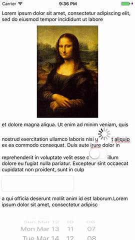

# SubviewAttachingTextView

[](https://github.com/Carthage/Carthage) []() []() []()

`SubviewAttachingTextView` is a `UITextView` subclass that allows embedding subviews in its attributed text as text attachments. The library also provides a `SubviewAttachingTextViewBehavior` class that allows compositing the attachment behavior in existing `UITextView` subclasses.

To see `SubviewAttachingTextView` in action, clone or download this repository and check out `Example.playground` inside `SubviewAttachingTextView.xcworkspace`.



## How it works

`SubviewAttachingTextView` is built on top of `NSTextAttachment` and Text Kit APIs available through `UITextView`. A custom subclass of `NSTextAttachment` allows keeping a reference to the embedded views, and text view's `NSLayoutManager` and `NSTextContainer` allow querying for the attachments' bounds as they're laid out inside the text, taking into account all paragraph style properties. `NSLayoutManager`'s and `NSTextStorage`'s delegate callbacks allow implementing automatic layout and attachment updates.

## Requirements

- Xcode 8.0+ (written in Swift 3)
- iOS 8.0+
- Compatible with Objective-C.

## Installation

### Carthage

1. Add the following line to your `Cartfile`:

    ```
    github "vlas-voloshin/SubviewAttachingTextView"
    ```
    
1. Follow the instructions outlined in [Carthage documentation](https://github.com/Carthage/Carthage/blob/master/README.md) to build and integrate the library into your app.

### CocoaPods

1. Add the following line to your `Podfile`:

	```
	pod 'SubviewAttachingTextView'
	```
	
2. Execute `pod install`.

### Manual

1. Download and copy the repository source files into your project, or add it as a submodule to your git repository.
1. Drag&drop `SubviewAttachingTextView.xcodeproj` into your project or workspace in Xcode.
1. In "General" tab of Project Settings → `Your Target`, you might find that Xcode has added a missing framework item in "Embedded Binaries". Delete it for now.
1. Still in "General" tab, add `SubviewAttachingTextView.framework` to "Embedded Binaries". This should also add it to "Linked Frameworks and Libraries". 

## Usage

There are two ways to integrate the subview attachment behavior in your text views; choose the one that fits your needs:

### As a drop-in `UITextView` replacement

Simply change the class of `UITextView` you use to `SubviewAttachingTextView` (in Swift code) or `VVSubviewAttachingTextView` (in Objective-C code and Interface Builder).

### In custom subclasses

You can easily integrate `SubviewAttachingTextViewBehavior` class into your custom `UITextView` subclass by following the implementation of `SubviewAttachingTextView`:

1. In both `init(frame:, textContainer:)` and `init?(coder:)` initializers, create a `SubviewAttachingTextViewBehavior` object (`VVSubviewAttachingTextViewBehavior` in Objective-C), store it in your text view instance.
1. Assign your text view to the behavior's `textView` property. It's a weak property, so this won't create a retain cycle.
1. Assing the behavior object to the text view's `layoutManager.delegate` and `textStorage.delegate`. This will enable the automatic attachment management.
	- If your custom text view already needs a different object to be its layout manager's or text storage's delegate, you can manually proxy the calls to `layoutManager(_:, didCompleteLayoutFor:, atEnd:)` and `textStorage(_:, didProcessEditing:, range:, changeInLength:)` delegate methods, but keep in mind that `SubviewAttachingTextViewBehavior` might require more methods in future.
1. Override the setter of `textContainerInset` property of your text view and make it call `layoutAttachedSubviews()` method of the attachment behavior. This ensures that the layout of attachments is updated when container insets are changed.

### Attaching subviews

To embed a view in your text, do the following:

- Create a `SubviewTextAttachment` instance (`VVSubviewTextAttachment` in Objective-C) and initialize it with a view object, optionally providing a size for the attachment.
	- If you don't provide a size explicitly, the attachment will attempt to use the view's fitting size (calculated using Auto Layout), falling back to the view's current size if a non-zero fitting size cannot be calculated.
- Alternatively, initialize the attachment with a view provider: an object conforming to `TextAttachedViewProvider` protocol (`VVTextAttachedViewProvider` in Objective-C). Using a view provider allows rendering the attributed string with an attachment in multiple text views at the same time, with each text view receiving its own instance of a view representing the attachment from the view provider. `TextAttachedViewProvider` also allows customizing the attached view's size during text layout.
- Create an `NSAttributedString` from the attachment using its `init(attachment:)` initializer.
- Insert the resulting string into your attributed text and assign it on the text view (either `SubviewAttachingTextView` or your custom text view embedding a `SubviewAttachingTextViewBehavior`).
- Adding and removing the attached subviews is managed automatically. If you want to remove an embedded subview, just remove the corresponding attachment from the text view's attributed text.
- If your text view is editable, user will also be able to delete the attachment just like any other text.

## Limitations

- Using pasteboard operations (copy, cut, paste) with subview attachments in editable text views is not supported at the moment.
- Text layout is not automatically updated if the attached view's intrinsic size changes. At the moment, to change the size of an attached subview, the layout manager needs to be notified to invalidate layout and display for the corresponding character range, or the attachment needs to be removed from the text attributes and then added back.

## License

This library is available under the MIT license. See the `LICENSE` file for more info.
